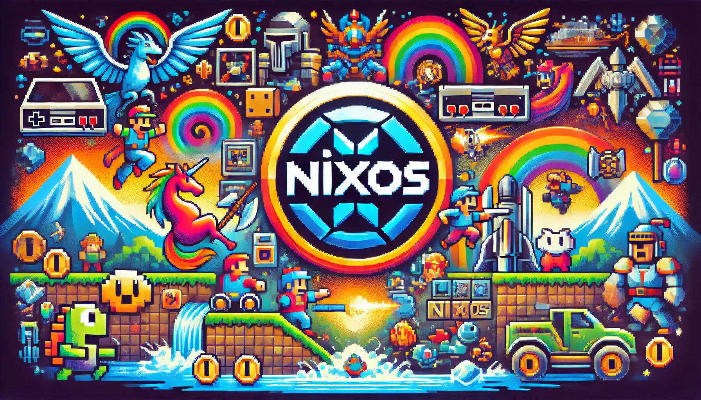
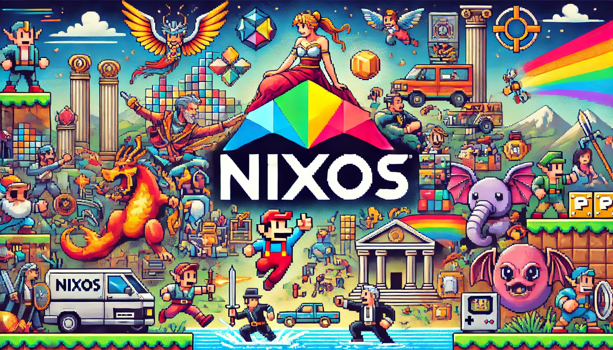

# Paradise NixOS Configuration

Welcome to my personal NixOS configuration repository! This setup is designed for a system codenamed "megaman" and showcases a highly customized and modular approach to NixOS and Home Manager configuration using Nix flakes.

## 🌟 Highlights

### 🖥️ Multi-Window Manager Support

- **Sway**: Wayland-based tiling window manager (my daily choice)
- **Hyprland**: Cutting-edge Wayland compositor
- **GNOME**: Traditional desktop environment with custom extensions
- **i3**: Classic X11 tiling window manager

### 🌐 Advanced Networking Configuration

- Custom VPN routing setup
- Dual-NIC configuration with specific traffic routing
- Tailscale integration for secure networking

### 🎨 Aesthetic and Functional Customizations

- **Stylix**: System-wide theming for a cohesive look
- **Waybar**: Highly customized status bar for Wayland
- **Custom Firefox Themes**: Personalized browser experience

## 🚀 Key Features

1. **Modular System Configuration**: Organized into easy-to-manage modules
2. **Home Manager Integration**: User environment management
4. **Virtualization**: QEMU, libvirt, and Docker support
5. **GPU Optimization**: Configured for AMD GPUs
6. **Custom Shell Experience**: Zsh with aliases and Zellij terminal multiplexer
7. **Declarative Package Management**: Extensive selection of curated packages (bloats nothing)

## 📁 Repository Structure

```
nix-configs/
├── flake.nix                 # Main flake configuration
├── home/                     # Home Manager configurations
├── system/                   # NixOS system configurations
│   ├── modules/              # Modular system settings
│   │   ├── networking/       # Advanced networking setup
│   │   └── graphical/        # Window manager configurations
│   └── hardware-configuration.nix
└── README.md
```

## 🔧 Usage

1. Clone the repository:

``` bash
# opinionated target folder for aliases purposes
git clone https://github.com/fredcamaral/nix-config.git ~/repos/nix-configs
cd nix-configs
```

2. Apply the configuration:

``` bash
sudo nixos-rebuild switch --flake .#megaman
```

3. Update and upgrade:

``` bash
sudo nixos-rebuild switch --flake .#megaman --upgrade
```

## 🤝 Contributing

Contributions, issues, and feature requests are welcome! Feel free to check issues page.

## 📜 License

This project is licensed under the MIT License - see the LICENSE file for details.

⚠️ Note: This configuration is tailored for a specific setup. Please review and adjust settings, especially hardware-specific ones, before applying to your own system. To be added: macOS, homelab, raspi and cloud server configs.


